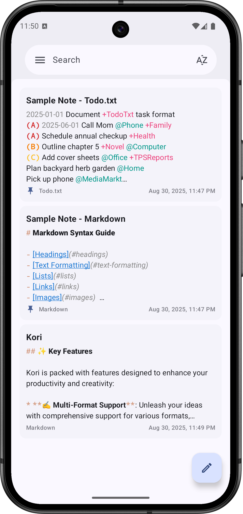
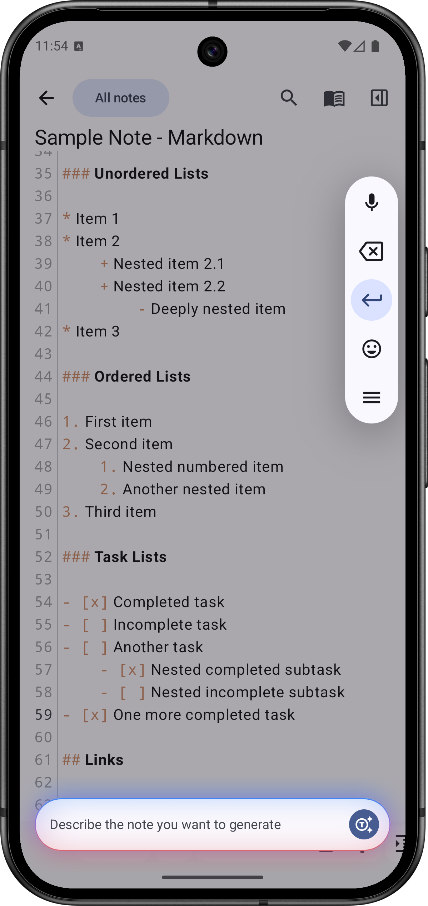
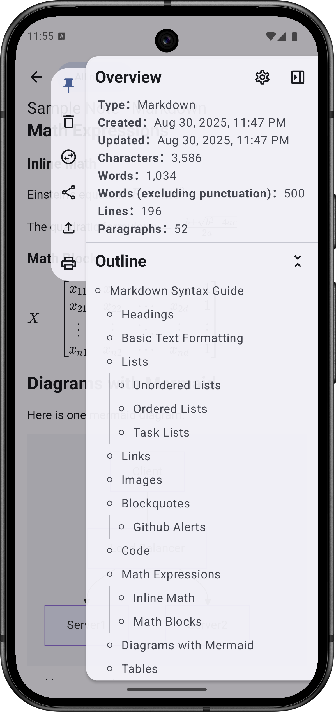
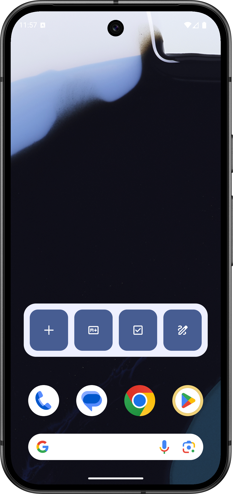
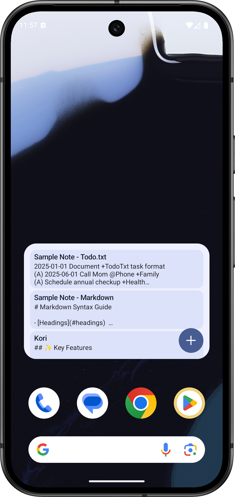
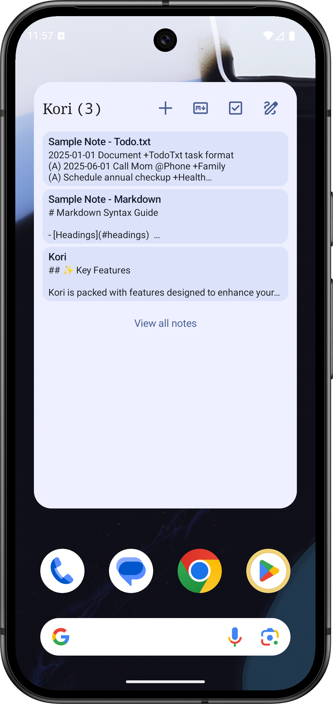
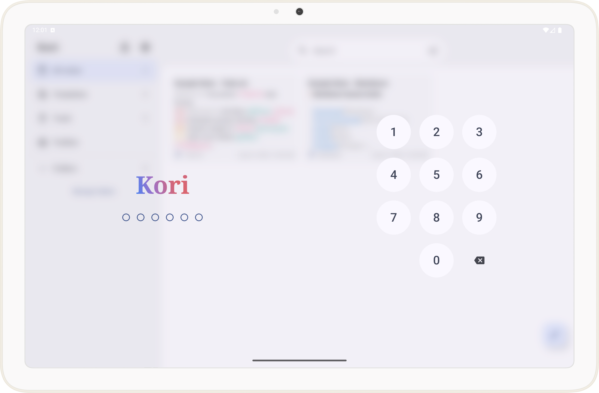
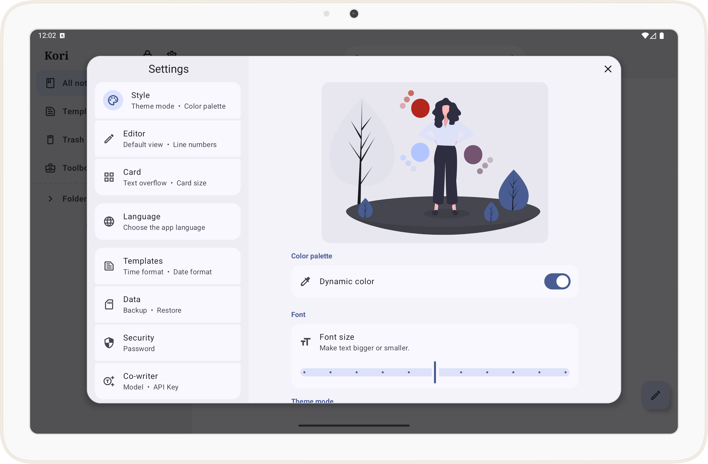
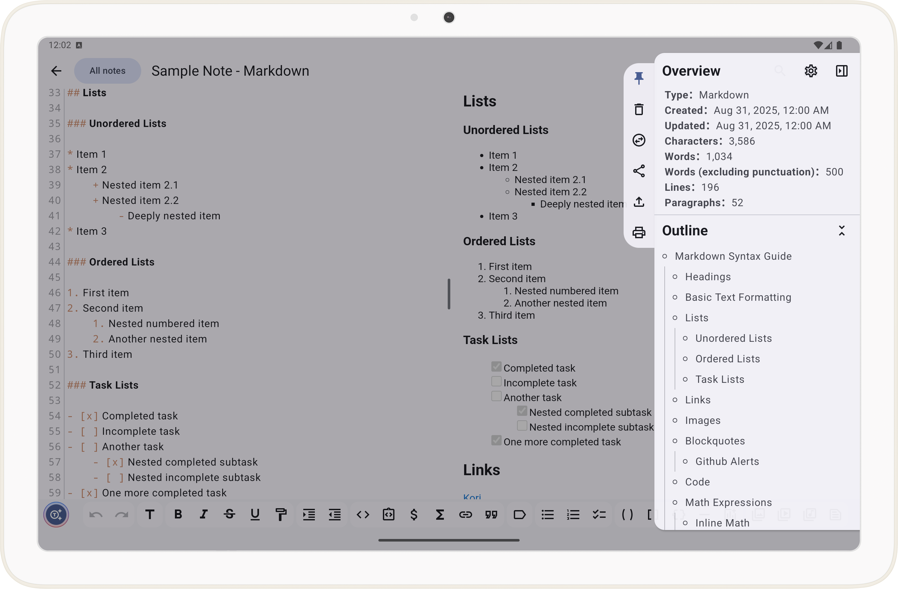

# Kori - A Unified Note-Taking Experience for All Platforms with AI Capabilities

Kori is an evolution of [Open Note](https://github.com/YangDai2003/OpenNote-Compose), aiming to
provide a consistent note-taking experience across all platforms.

To balance the account fees of the app store, the app will be sold at a very low price. You can also
get it for free from GitHub. The app itself is no different. Thank you for your support and
understanding.

## ✨ Key Features

Kori is packed with features designed to enhance your productivity and creativity:

* **✍️ Multi-Format Support**: Unleash your ideas with comprehensive support for various formats,
  including _Drawing_, _Markdown_, _TXT_, _LaTeX_, _Mermaid_ diagrams, and organized _Todo.txt_
  lists.

* **💻 Truly Cross-Platform**: Enjoy a unified experience whether you're on _Android_, _iOS_,
  _Windows_, _macOS_, or _Linux_. A _Web_ version is also planned for the future.

* **🤖 Intelligent & Optional AI Co-writer**:
    * Boost your writing with deeply integrated AI capabilities for content generation,
      summarization, rewriting, and more.
    * Connect to a wide range of large language models (LLMs) from providers like _Google_,
      _OpenAI_, _Anthropic_, and _DeepSeek_ using your own API keys.
    * Flexibly use self-hosted models (e.g., _Ollama_, _LMStudio_) by configuring the base URL.
    * All AI features are entirely optional. **You can completely disable all AI functionalities**.

### Advanced Capabilities:

- **Note SideSheet**: Automatically generates a **note outline** based on heading levels, allowing
  you to click and scroll to the corresponding section. Displays **word count, line count, and more
  ** at a glance.
- **Find and replace**: The note is too long and you can't find the location of a certain text? Want
  to modify it in batches but it's too annoying to edit one by one? Try this feature.
- **Note Templates:** Insert notes from the "Templates" folder as templates, with automatic date and
  time formatting.
- **Local Image, Video and Audio Support:** Directly import local images, videos and audio from the
  device into notes, with in-app preview.

### Additional Features:

- **Accept Shared Text:** The app can directly receive text shared from other applications and
  create a new note with it.
- **Directly Open Documents:** The app can be selected as handler for various text document types (
  such as .txt, .md, and .html), allowing them to be opened directly and converted into notes.
- **Export Options:** Notes can be exported in various formats, including TXT, Markdown, PDF, and
  HTML, for versatile sharing and usage.
- **Material 3 Expressive Design:** Adheres to Material Design 3 Expressive guidelines for a modern
  and cohesive user interface.
- **Comprehensive Mouse and Keyboard Support:** The app has been thoroughly adapted for seamless
  interaction with mice and external physical keyboards.
- **Responsive Design:** Optimized for various screen sizes and device orientations.

## 🖼️ Screenshots

### Phone

  
  
  
  
  
  

### Tablet

  
  
  

### Desktop

  
  
  

## 🌎 Translations

Currently supports Chinese, English and German.

## 💡 How to Use Kori with Markdown, LaTeX Math, and Mermaid Diagrams?

You can know more about how to use Kori with Markdown, LaTeX Math, and Mermaid Diagrams in
the [Guide](Guide.md).

## 🔐 Privacy Policy and Required Permissions

You can find the Privacy Policy and Required Permissions in the [Privacy Policy](PRIVACY_POLICY.md).

## 🎈 Contribution

* **Report an Issue**: Encounter a problem? Report it
  on [creating an issue](https://github.com/YangDai2003/Kori/issues).
* **Contribute Code**: Have a fix or a new feature? Contribute it
  on [submit a pull request](https://github.com/YangDai2003/Kori/pulls).